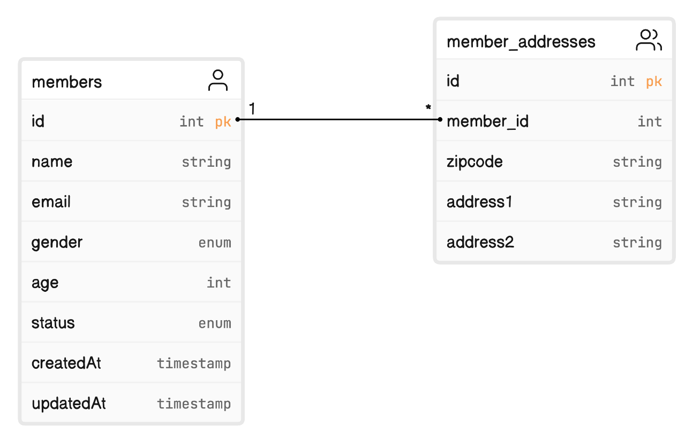

# Welcome to hexagonal-architecture-v2 👋

> For the purpose of representing architectural structure rather than verifying functionality, this project may not actually be executable.

> I have designed a structure for a simple API that allows user registration and retrieval of members. It is a customized architecture, not hexagonal. I recommand to use [hexagonal-architecture-v1](https://github.com/maketheworldwise/hexagonal-architecture-v1).

## Table



## Structure

```
.
├── application
│   ├── command
│   │   ├── join-member-address.command.ts
│   │   └── join-member.command.ts
│   ├── port
│   │   ├── i.create-member-address.port.ts
│   │   └── i.create-member.port.ts
│   ├── query
│   │   └── get-member-info.query.ts
│   └── usecase
│       └── join-member.service.ts
├── domain
│   ├── member-addresses.ts
│   └── members.ts
├── infra
│   ├── adapter
│   │   ├── create-member-address.adapter.ts
│   │   ├── create-member.adapter.ts
│   │   └── read-member.adapter.ts
│   └── db
│       ├── entity
│       │   ├── member-addresses.entity.ts
│       │   └── members.entity.ts
│       ├── mapper
│       │   ├── member-addresses.mapper.ts
│       │   └── member.mapper.ts
│       └── repository
│           ├── member-addresses.repository.ts
│           └── members.repository.ts
├── interface
│   ├── controller
│   │   ├── dto
│   │   │   └── join-member.dto.ts
│   │   ├── join-member.controller.ts
│   │   └── my-page.controller.ts
│   └── external
│       ├── i.get-member-info.query.ts
│       └── i.join-member.usecase.ts
└── members.module.ts
```

## Result

```
POST http://127.0.0.1:8080/join
{
    "name": "hello",
    "email": "hello@example.com",
    "gender": "man",
    "age": 26,
    "zipcode": "00000",
    "address1": "hello address1",
    "address2": "hello address2"
}

GET http://127.0.0.1:8080/me/2
{
    "name": "world",
    "email": "world@example.com",
    "gender": "woman",
    "age": 26,
    "zipcode": "11111",
    "address1": "world address1",
    "address2": "world address2"
}
```

## Author

👤 **Kevin Ahn**

* Github: [@maketheworldwise](https://github.com/maketheworldwise)